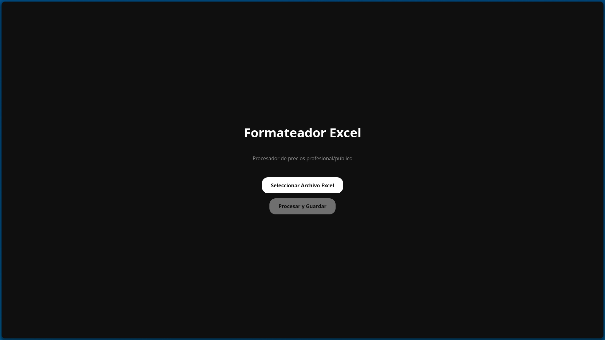

<div align="center">
   
  <h1>Formateador Excel</h1>
  <p>
    <strong>Procesador profesional de listas de precios</strong>
  </p>

  <!-- Badges -->
  <p>
    
    
    
    
    
  </p>
  <p>
    
    
    
    
  </p>
</div>

<div align="center">
  
  <p><em>Organiza tus finanzas con claridad y estilo</em></p>
</div>

---

## Descripción 

**Formateador Excel** es una aplicación de escritorio diseñada para automatizar el procesamiento de listas de precios en formato Excel. Permite convertir archivos Excel multi-hoja con diferentes formatos en un archivo estandarizado con columnas uniformes, facilitando la gestión de catálogos de productos y precios profesionales/públicos.

> **Nota**: Esta aplicación es un ejemplo de uso interno y está diseñada para un propósito específico de procesamiento de datos.

##  Funcionalidades

### Procesamiento Inteligente
*   **Detección Automática de Columnas**: Identifica automáticamente las columnas de productos, precios profesionales y precios públicos usando sinónimos y heurísticas avanzadas.
*   **Soporte Multi-Hoja**: Procesa múltiples hojas de cálculo en un solo archivo, extrayendo la categoría del nombre de cada hoja.
*   **Cálculo Automático de Precios**: Si falta el precio profesional o público, lo calcula automáticamente usando un factor de conversión (1.35x).
*   **Eliminación de Duplicados**: Remueve filas duplicadas idénticas para mantener la integridad de los datos.

### Detección Flexible
*   **Reconocimiento de Sinónimos**: Detecta múltiples variantes de nombres de columnas:
  - **Productos**: "producto", "productos", "nombre", "artículo", "descripción", "detalle", "concepto", "marca", etc.
  - **Precio Profesional**: "profesional", "pro", "sugerido profesional", "precio pro", "infinito", etc.
  - **Precio Público**: "publico", "público", "sugerido publico", "precio público", etc.
*   **Exclusión de IDs**: Ignora automáticamente columnas de códigos o IDs que podrían confundir la detección.
*   **Hojas Especiales**: Excluye hojas específicas como "COLLAGE" del procesamiento.

### Salida Estandarizada
*   **Formato Único**: Genera un archivo Excel con una sola hoja llamada "Lista de Precios".
*   **Columnas Fijas**: 
  - `producto`: Nombre del producto
  - `precio profesional`: Precio para profesionales
  - `precio público`: Precio para público general
  - `categoría`: Nombre de la hoja de origen
*   **Guardado Automático**: Guarda el archivo en `~/Documentos/` con formato `salida_YYYY-MM-DD.xlsx`.
*   **Sin Sobrescritura**: Si el archivo ya existe, agrega un contador automático (`salida_YYYY-MM-DD_1.xlsx`).

---

##  Uso de la Aplicación

La interfaz es minimalista y directa:

1. **Seleccionar Archivo**: Haz clic en "Seleccionar Archivo Excel" para elegir el archivo `.xlsx` a procesar.
2. **Procesar**: Una vez seleccionado, haz clic en "Procesar y Guardar" para iniciar el procesamiento.
3. **Resultado**: La aplicación mostrará la ruta del archivo generado y el número de filas procesadas.

---

##  Ejemplo de Uso

**Archivo de Entrada** (multi-hoja con diferentes formatos):
- Hoja "Shampoos": Columnas variadas con "Producto", "Pro", "Público"
- Hoja "Tintes": Columnas con "Nombre", "Profesional", "Publico"
- Hoja "COLLAGE": Ignorada automáticamente

**Archivo de Salida** (`~/Documentos/salida_2026-01-18.xlsx`):
```
| producto          | precio profesional | precio público | categoría |
|-------------------|-------------------|----------------|-----------|
| Shampoo Keratina  | 150.00           | 202.50         | Shampoos  |
| Tinte Castaño     | 200.00           | 270.00         | Tintes    |
```

---

<div align="center">
  <p>Desarrollado por <strong>Diego Ledesma</strong></p>
  <p><em>Versión 1.0.0 - Enero 2026</em></p>
</div>
